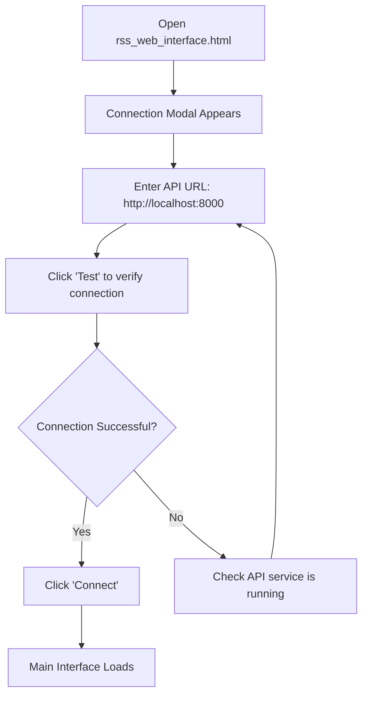
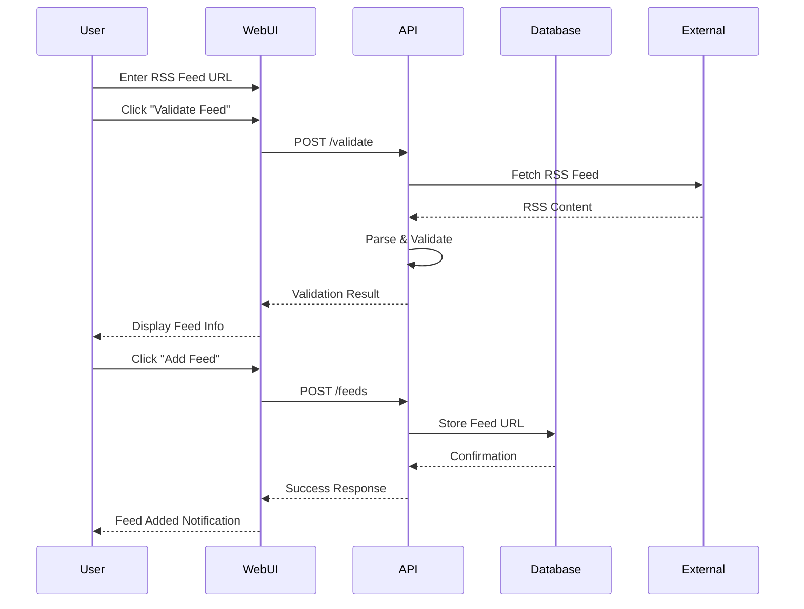
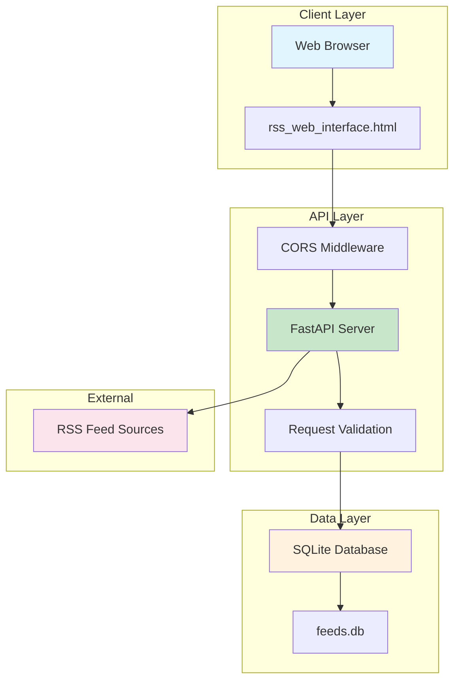

# xsukax RSS Search

[](https://www.gnu.org/licenses/gpl-3.0)
[](https://www.python.org/downloads/)
[](https://fastapi.tiangolo.com/)

A privacy-focused, self-hosted RSS feed search and management system that enables users to aggregate, search, and manage multiple RSS feeds through a terminal-styled web interface.

## Project Overview

xsukax RSS Search is a comprehensive RSS feed aggregation and search solution designed for users who value privacy and control over their news consumption. The application consists of two main components:

- **Backend API Service** (`rss_api_service.py`): A FastAPI-based REST API that handles RSS feed management, validation, and search functionality
- **Frontend Web Interface** (`rss_web_interface.html`): A retro terminal-themed HTML/JavaScript interface for interacting with the API

The system allows users to add multiple RSS feeds, validate their integrity, and perform sophisticated keyword-based searches across all configured feeds simultaneously. Results are aggregated, deduplicated, and presented in a chronologically sorted format.

## Security and Privacy Benefits

### **Complete Data Sovereignty**
- **Self-Hosted Architecture**: All data remains on your infrastructure—no third-party services or cloud dependencies
- **Local SQLite Database**: Feed URLs and search history stored locally in `feeds.db`
- **No External Analytics**: Zero tracking, telemetry, or data collection mechanisms

### **Privacy-Preserving Design**
- **Direct Feed Access**: Fetches RSS feeds directly from sources without intermediary services
- **No User Accounts**: No registration, authentication, or personal data collection required
- **Minimal Data Retention**: Only stores feed URLs; no search queries, results, or user behavior tracking

### **Network Security**
- **CORS Protection**: Configurable Cross-Origin Resource Sharing policies
- **Request Timeout Controls**: Built-in protection against slow or malicious feeds (10-second timeout)
- **User-Agent Identification**: Transparent identification in requests (`xsukax-RSS-Search/1.0`)

### **Input Validation and Sanitization**
- **URL Validation**: Strict validation of RSS feed URLs before processing
- **Content Escaping**: HTML content properly escaped in the web interface
- **Feed Validation**: Comprehensive validation of RSS feed structure and content before addition

## Features and Advantages

### **Advanced Search Capabilities**
- **Multi-Field Search**: Search within titles, descriptions, or both simultaneously
- **Flexible Matching**: Support for "any keyword" or "all keywords" matching modes
- **Result Limiting**: Configurable maximum results to optimize performance
- **Unicode Normalization**: Robust text processing supporting international content

### **Feed Management**
- **Real-Time Validation**: Validate RSS feeds before adding to ensure they're accessible and properly formatted
- **Concurrent Processing**: Multi-threaded feed fetching for optimal performance (up to 10 concurrent connections)
- **Error Handling**: Graceful handling of failed feeds with detailed error reporting
- **Duplicate Detection**: Automatic deduplication of articles across multiple feeds

### **User Experience**
- **Retro Terminal Aesthetic**: Distinctive green-on-black terminal styling with subtle animations
- **Responsive Design**: Mobile-friendly interface that adapts to different screen sizes
- **Real-Time Feedback**: Live connection status, validation results, and search progress indicators
- **Keyboard Shortcuts**: Ctrl+Enter for quick search execution

### **Technical Advantages**
- **Lightweight Dependencies**: Minimal external dependencies for easy deployment
- **RESTful API**: Well-documented API endpoints for potential integration with other tools
- **SQLite Backend**: Zero-configuration database with excellent performance for typical use cases
- **Concurrent Architecture**: Efficient handling of multiple RSS feeds through thread pool execution

## Installation Instructions

### Prerequisites

- Python 3.8 or higher
- pip (Python package installer)
- Modern web browser (Chrome, Firefox, Safari, Edge)

### Step 1: Clone the Repository

```bash
git clone https://github.com/xsukax/xsukax-RSS-Search.git
cd xsukax-RSS-Search
```

### Step 2: Install Python Dependencies

```bash
pip install fastapi uvicorn requests feedparser
```

Or using a virtual environment (recommended):

```bash
python -m venv venv
source venv/bin/activate  # On Windows: venv\Scripts\activate
pip install fastapi uvicorn requests feedparser
```

### Step 3: Initialize the Database

The SQLite database will be automatically created when you first run the API service.

### Step 4: Start the API Service

```bash
python rss_api_service.py
```

The API will be available at `http://localhost:8000`. You should see output similar to:

```
Starting xsukax RSS Search API...
Access at: http://localhost:8000
INFO:     Started server process [12345]
INFO:     Uvicorn running on http://0.0.0.0:8000
```

### Step 5: Access the Web Interface

Open `rss_web_interface.html` in your web browser. The connection modal will appear automatically—ensure the API URL is set to `http://localhost:8000` and click "Connect".

## Usage Guide

### Initial Setup



### Feed Management Workflow



### Adding RSS Feeds

1. **Enter Feed URL**: Input a valid RSS feed URL in the "RSS Feed URL" field
2. **Validate (Optional)**: Click "Validate Feed" to check the feed's structure and content
3. **Add Feed**: Click "Add Feed" to permanently add the feed to your collection
4. **View Feeds**: Your configured feeds appear in the "Current Feeds" section

### Performing Searches

1. **Enter Keywords**: Input search terms in the keywords field (comma-separated)
2. **Configure Search**:
   - **Search In**: Choose to search titles only, descriptions only, or both
   - **Match Mode**: Select "Any Keyword" or "All Keywords" matching
   - **Max Results**: Set a limit for returned results (0 = unlimited)
3. **Execute Search**: Click "Execute Search" or use Ctrl+Enter
4. **Review Results**: Results appear below with title, source, date, and summary

### Search Configuration Options

| Setting | Options | Description |
|---------|---------|-------------|
| Search In | Title & Description, Title Only, Description Only | Defines which fields to search |
| Match Mode | Any Keyword, All Keywords | Whether to match any or all provided keywords |
| Max Results | 1-500, 0 for unlimited | Limits the number of results returned |

### API Endpoints

The REST API provides programmatic access to all functionality:

| Endpoint | Method | Description |
|----------|--------|-------------|
| `/health` | GET | Check API service status |
| `/feeds` | GET | List all configured feeds |
| `/feeds` | POST | Add a new RSS feed |
| `/feeds/{id}` | DELETE | Remove a specific feed |
| `/validate` | POST | Validate an RSS feed URL |
| `/search` | POST | Search across all feeds |

### Example API Usage

```bash
# Check API health
curl http://localhost:8000/health

# Add a new feed
curl -X POST http://localhost:8000/feeds \
  -H "Content-Type: application/json" \
  -d '{"url": "https://example.com/rss.xml"}'

# Search feeds
curl -X POST http://localhost:8000/search \
  -H "Content-Type: application/json" \
  -d '{
    "keywords": "technology, AI",
    "field": "both",
    "mode": "any",
    "max_results": 10
  }'
```

### Architecture Overview



## Troubleshooting

### Common Issues

**API Connection Failed**
- Ensure the Python API service is running (`python rss_api_service.py`)
- Verify the API URL in the connection modal (typically `http://localhost:8000`)
- Check for firewall restrictions on port 8000

**Feed Validation Errors**
- Ensure the RSS feed URL is accessible and returns valid XML
- Some feeds may have strict user-agent requirements or rate limiting
- Try accessing the feed URL directly in a browser to verify availability

**Search Returns No Results**
- Verify that feeds contain entries matching your keywords
- Try broader search terms or switch from "All Keywords" to "Any Keyword" mode
- Check the "Failed Feeds" count in search results for problematic feeds

## Licensing Information

This project is licensed under the **GNU General Public License v3.0 (GPL-3.0)**.

### What This Means

**For Users:**
- ✅ **Freedom to Use**: You can use this software for any purpose, including commercial use
- ✅ **Freedom to Study**: You have access to the complete source code
- ✅ **Freedom to Modify**: You can modify the software to suit your needs
- ✅ **Freedom to Distribute**: You can share the software with others

**For Contributors:**
- 📋 **Copyleft Protection**: Any derivative works must also be licensed under GPL-3.0
- 📋 **Source Code Availability**: If you distribute modified versions, you must provide the source code
- 📋 **License Compatibility**: Ensure any additional dependencies are GPL-3.0 compatible

**Key Provisions:**
- No warranty is provided with this software
- You must include the original license and copyright notices
- You must clearly state any changes made to the original software
- Network use alone does not trigger distribution requirements

For the complete license text, see the [LICENSE](LICENSE) file or visit [https://www.gnu.org/licenses/gpl-3.0.html](https://www.gnu.org/licenses/gpl-3.0.html).

---

**Built with privacy and freedom in mind** 🔒

For questions, issues, or contributions, please visit our [GitHub repository](https://github.com/xsukax/xsukax-RSS-Search).
