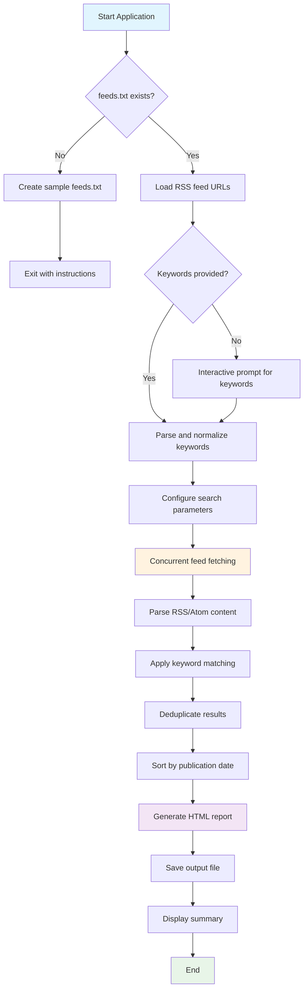
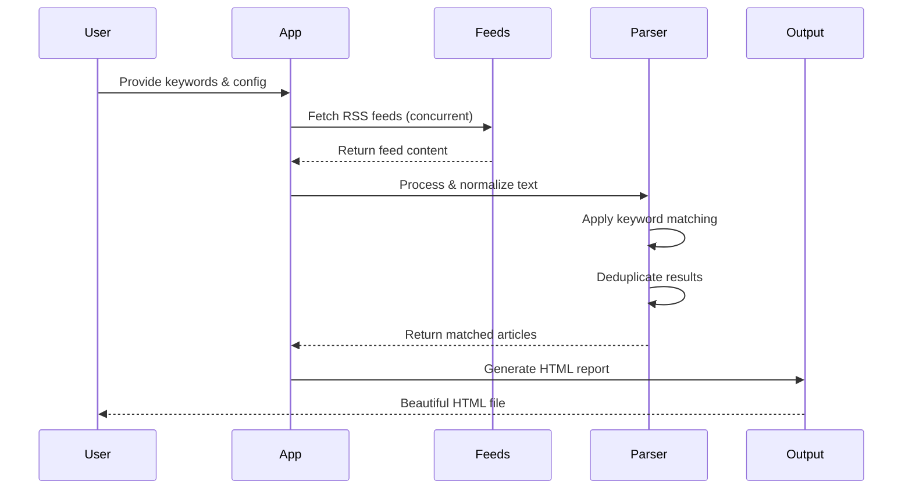

# xsukax RSS Search

[](https://www.gnu.org/licenses/gpl-3.0)
[](https://www.python.org/downloads/)

A powerful, privacy-focused RSS keyword search tool that aggregates content from multiple feeds and generates beautiful, Apple-style HTML reports. Designed with security, performance, and multilingual support in mind.

## 🔍 Project Overview

**xsukax RSS Search** is a sophisticated command-line application that enables users to search across multiple RSS and Atom feeds for specific keywords, generating comprehensive HTML reports with modern, responsive design. The tool excels at processing both English and Arabic content through advanced Unicode normalization, making it ideal for multilingual news monitoring, research, and content aggregation.

### Key Capabilities

- **Multi-feed aggregation**: Search across unlimited RSS/Atom feeds simultaneously
- **Intelligent keyword matching**: Support for partial matching with Arabic and English text normalization
- **Flexible search modes**: Match ANY or ALL keywords across titles, descriptions, or both
- **High-performance processing**: Concurrent feed fetching with configurable timeout and thread limits
- **Professional output**: Generate Apple-inspired HTML reports with dark mode support
- **Deduplication**: Automatic removal of duplicate articles across feeds
- **Chronological sorting**: Results ordered by publication date (newest first)

## 🔒 Security and Privacy Benefits

### Privacy-First Architecture
- **100% Local Processing**: All data processing occurs locally on your machine—no external services receive your search queries or feed data
- **No Data Transmission**: Your search keywords and results never leave your system
- **Zero Tracking**: No analytics, telemetry, or user behavior monitoring
- **Offline Capability**: Works entirely offline after initial feed fetching

### Security Measures
- **Input Sanitization**: All HTML output is properly escaped to prevent XSS attacks
- **Safe File Handling**: Robust file I/O with proper encoding and error handling
- **Request Security**: Custom User-Agent and configurable timeouts prevent hanging requests
- **Error Isolation**: Failed feeds don't compromise the entire search operation
- **Memory Safety**: Efficient memory usage with streaming processing of large feeds

### Data Protection
- **No Persistent Storage**: Search results are only saved when explicitly requested
- **Configurable Output**: Choose your own output location and filename patterns
- **Clean Exit**: Graceful shutdown with proper resource cleanup

## ✨ Features and Advantages

### 🌐 Multilingual Excellence
- **Arabic Text Support**: Advanced Unicode normalization for Arabic script
- **Diacritic Handling**: Intelligent removal of Arabic diacritics for better matching
- **Alef Normalization**: Automatic handling of different Alef forms in Arabic
- **Mixed Language**: Seamless support for Arabic-English mixed content

### ⚡ Performance Optimized
- **Concurrent Processing**: Multi-threaded feed fetching (default: 16 concurrent connections)
- **Intelligent Timeouts**: Configurable request timeouts prevent hanging
- **Memory Efficient**: Streaming processing of large feeds
- **Deduplication**: Automatic removal of duplicate articles across feeds

### 🎨 Beautiful Output
- **Apple-Style Design**: Modern, clean HTML reports inspired by Apple's design language
- **Responsive Layout**: Perfect display on desktop, tablet, and mobile devices
- **Dark Mode Support**: Automatic dark/light theme detection
- **Visual Hierarchy**: Clear typography and spacing for optimal readability
- **Interactive Elements**: Hover effects and smooth transitions

### 🔧 Developer-Friendly
- **Command-Line Interface**: Full automation support with comprehensive CLI options
- **Interactive Mode**: User-friendly prompts for manual operation
- **Flexible Configuration**: Customizable search parameters and output options
- **Error Reporting**: Detailed error messages and graceful failure handling

## 📦 Installation Instructions

### Prerequisites
- **Python 3.6 or higher**
- **pip** (Python package installer)

### Step 1: Clone the Repository
```bash
git clone https://github.com/xsukax/xsukax-RSS-Search.git
cd xsukax-RSS-Search
```

### Step 2: Install Dependencies
```bash
pip install -r requirements.txt
```

Or install dependencies manually:
```bash
pip install feedparser requests
```

### Step 3: Make Script Executable (Linux/macOS)
```bash
chmod +x xsukax_rss_search.py
```

### Step 4: Create Feed Configuration
The application will automatically create a sample `feeds.txt` file on first run, or you can create it manually:

```bash
touch feeds.txt
```

Add your RSS/Atom feed URLs (one per line):
```
# feeds.txt - RSS/Atom feeds configuration
https://feeds.bbci.co.uk/news/rss.xml
http://rss.cnn.com/rss/edition.rss
https://rss.nytimes.com/services/xml/rss/nyt/HomePage.xml
# Lines starting with # are comments
```

## 🚀 Usage Guide

### Basic Usage

#### Interactive Mode
```bash
python3 xsukax_rss_search.py
```
The application will prompt you for:
- Keywords (comma-separated)
- Search field (title/description/both)
- Match mode (any/all)

#### Command-Line Mode
```bash
python3 xsukax_rss_search.py -k "artificial intelligence, machine learning" -f both -m any
```

### Advanced Options

#### Complete Command-Line Interface
```bash
python3 xsukax_rss_search.py \
  --keywords "climate change,global warming" \
  --field description \
  --mode all \
  --output "climate_report.html" \
  --feeds-file "custom_feeds.txt" \
  --timeout 15 \
  --concurrency 20 \
  --max 100
```

### Command-Line Arguments

| Argument | Short | Description | Default |
|----------|-------|-------------|---------|
| `--keywords` | `-k` | Comma-separated keywords | Interactive prompt |
| `--field` | `-f` | Search field: `title`, `description`, `both` | `both` |
| `--mode` | `-m` | Match mode: `any`, `all` | `any` |
| `--output` | `-o` | Output HTML filename | Auto-generated |
| `--feeds-file` | `-F` | Path to feeds configuration file | `feeds.txt` |
| `--timeout` | | Request timeout in seconds | `12` |
| `--concurrency` | `-c` | Maximum concurrent connections | `16` |
| `--max` | | Maximum results to display | `0` (unlimited) |

### Application Workflow


```mermaid
graph TD
    A[Start Application] --> B{feeds.txt exists?}
    B -->|No| C[Create sample feeds.txt]
    C --> D[Exit with instructions]
    B -->|Yes| E[Load RSS feed URLs]
    E --> F{Keywords provided?}
    F -->|No| G[Interactive prompt for keywords]
    F -->|Yes| H[Parse and normalize keywords]
    G --> H
    H --> I[Configure search parameters]
    I --> J[Concurrent feed fetching]
    J --> K[Parse RSS/Atom content]
    K --> L[Apply keyword matching]
    L --> M[Deduplicate results]
    M --> N[Sort by publication date]
    N --> O[Generate HTML report]
    O --> P[Save output file]
    P --> Q[Display summary]
    Q --> R[End]
    
    style A fill:#e1f5fe
    style J fill:#fff3e0
    style O fill:#f3e5f5
    style R fill:#e8f5e8
```

### Search Process Flow


```mermaid
sequenceDiagram
    participant User
    participant App
    participant Feeds
    participant Parser
    participant Output
    
    User->>App: Provide keywords & config
    App->>Feeds: Fetch RSS feeds (concurrent)
    Feeds-->>App: Return feed content
    App->>Parser: Process & normalize text
    Parser->>Parser: Apply keyword matching
    Parser->>Parser: Deduplicate results
    Parser-->>App: Return matched articles
    App->>Output: Generate HTML report
    Output-->>User: Beautiful HTML file
```

### Example Use Cases

#### 1. News Monitoring
```bash
python3 xsukax_rss_search.py -k "cybersecurity,data breach" -f title -m any
```

#### 2. Research Aggregation
```bash
python3 xsukax_rss_search.py -k "renewable energy" -f both -m all --max 50
```

#### 3. Arabic Content Search
```bash
python3 xsukax_rss_search.py -k "الذكاء الاصطناعي,التكنولوجيا" -f description
```

#### 4. Custom Feed File
```bash
python3 xsukax_rss_search.py -k "bitcoin,cryptocurrency" -F crypto_feeds.txt
```

### Output Format

The generated HTML report includes:

- **Header Section**: Search parameters, feed count, and result statistics
- **Responsive Grid**: Article cards with titles, sources, dates, and excerpts
- **Visual Indicators**: Color-coded status information
- **Error Reporting**: Clear indication of failed feeds
- **Modern Styling**: Apple-inspired design with dark mode support

### Configuration Tips

#### Optimizing Performance
- **Concurrency**: Increase `--concurrency` for faster processing (default: 16)
- **Timeout**: Adjust `--timeout` based on network conditions (default: 12s)
- **Feed Selection**: Use high-quality, fast-responding feeds

#### Improving Search Quality
- **Keyword Strategy**: Use specific terms for better precision
- **Field Selection**: Search titles for headlines, descriptions for detailed content
- **Match Mode**: Use "all" for precise matching, "any" for broader results

## 📜 Licensing Information

This project is licensed under the **GNU General Public License v3.0 (GPL-3.0)**.

### What This License Means

#### ✅ You Are Free To:
- **Use** the software for any purpose, including commercial use
- **Study** the source code and understand how it works
- **Modify** the software to suit your needs
- **Distribute** copies of the original software
- **Distribute** modified versions of the software

#### 📋 Your Obligations:
- **Share Source Code**: If you distribute the software (modified or unmodified), you must provide the source code
- **Same License**: Any derivative works must be licensed under GPL-3.0
- **Copyright Notice**: Preserve copyright notices and license information
- **Disclose Changes**: Clearly indicate any modifications you make

#### 🔒 Protections:
- **No Warranty**: The software is provided "as-is" without warranties
- **Liability Protection**: Authors are not liable for damages
- **Patent Protection**: The license includes patent protection clauses

### Full License Text
The complete license text is available in the [LICENSE](LICENSE) file included with this repository, or online at: https://www.gnu.org/licenses/gpl-3.0.html

### Why GPL-3.0?
We chose GPL-3.0 to ensure that this privacy-focused tool remains free and open source, guaranteeing that all users can access, audit, and improve the code while preventing proprietary derivatives that could compromise user privacy.

---

## 🤝 Contributing

We welcome contributions! Please read our contributing guidelines and ensure all contributions comply with the GPL-3.0 license.

## 📞 Support

For issues, questions, or suggestions, please open an issue on our GitHub repository.

## 🌟 Acknowledgments

Built with Python, leveraging the excellent `feedparser` and `requests` libraries. Inspired by Apple's design philosophy and the open-source community's commitment to privacy and security.

---

**Made with ❤️ for the open-source community**
