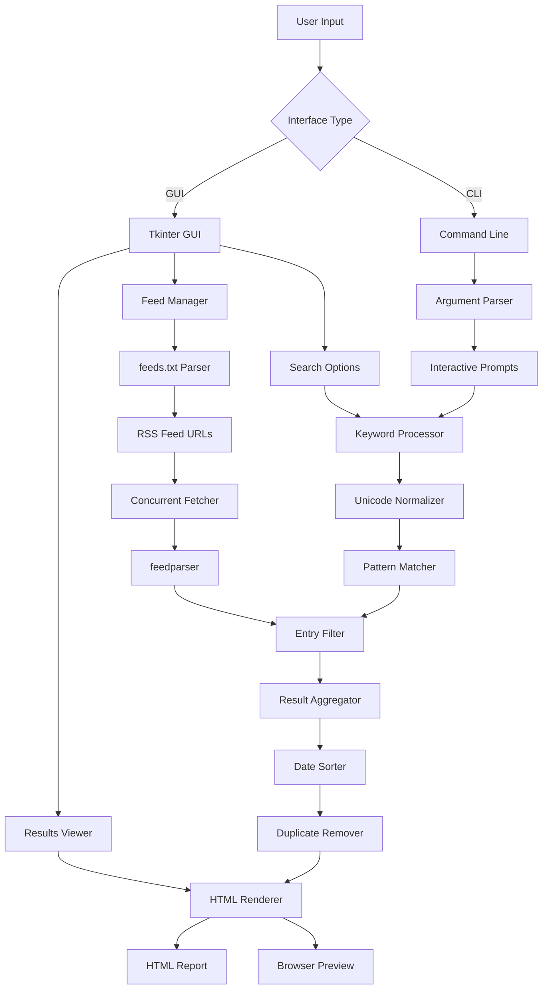
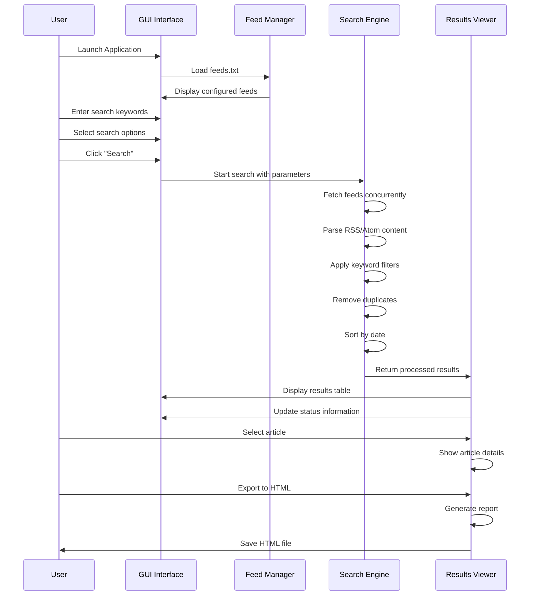

# xsukax RSS Search CLI & GUI

A powerful, privacy-focused RSS feed search tool that enables users to search multiple RSS/Atom feeds simultaneously for specific keywords. The application supports both Arabic and English text with intelligent Unicode normalization and offers both command-line and modern graphical interfaces.

## Project Overview

xsukax RSS Search is a comprehensive solution for monitoring and searching RSS feeds across multiple sources. The tool reads feed URLs from a simple text configuration file, fetches content concurrently for optimal performance, and provides sophisticated keyword matching with support for multilingual content. Results are presented through both a modern GUI interface and beautifully formatted HTML reports with Apple-inspired design.

### Core Capabilities

- **Multi-source RSS/Atom feed aggregation** from user-configurable sources
- **Intelligent keyword search** with Arabic and English text normalization
- **Concurrent feed processing** for enhanced performance
- **Flexible search options** (title-only, description-only, or both)
- **Multiple match modes** (ANY or ALL keywords)
- **Modern GUI interface** with dark/light theme support
- **Professional HTML report generation** with responsive design
- **Cross-platform compatibility** (Windows, macOS, Linux)

## Security and Privacy Benefits

### Local Processing Architecture
- **Zero external data transmission**: All processing occurs locally on your machine
- **No cloud dependencies**: RSS feeds are fetched directly without intermediary services
- **Private keyword searches**: Search terms never leave your device
- **No user tracking**: Application contains no analytics or telemetry components

### Data Protection Features
- **Input validation**: Comprehensive sanitization of all user inputs and feed content
- **Safe HTML rendering**: Proper escaping prevents XSS vulnerabilities in generated reports
- **Responsible web scraping**: Implements proper User-Agent headers and timeout mechanisms
- **Error isolation**: Robust exception handling prevents data leakage through error messages
- **Secure file operations**: Safe file I/O with proper encoding and path validation

### Privacy-First Design
- **Configurable feed sources**: Users maintain complete control over data sources
- **Local storage only**: All configuration and results stored exclusively on user's device
- **No external dependencies**: Core functionality operates without internet connectivity to third-party services
- **Transparent operation**: Open-source codebase allows full security audit

## Features and Advantages

### Advanced Text Processing
- **Unicode normalization** for accurate Arabic and English text matching
- **Intelligent character mapping** (alef forms, diacritics removal, tatweel handling)
- **Case-insensitive matching** with cultural sensitivity
- **Flexible keyword parsing** supporting comma and newline delimiters

### Performance Optimization
- **Concurrent feed fetching** with configurable thread pools
- **Duplicate detection** prevents redundant results
- **Memory-efficient processing** suitable for large feed collections
- **Configurable timeout controls** for reliable network operations

### User Experience Excellence
- **Modern GUI interface** with professional appearance
- **Feed management system** with add/edit/remove/import capabilities
- **Real-time progress indication** with cancellation support
- **Responsive design** adapting to different screen sizes
- **Context-sensitive help** and error messaging

### Output and Reporting
- **Apple-inspired HTML design** with dark/light mode support
- **Mobile-responsive layouts** for cross-device compatibility
- **Structured metadata display** including source attribution and timestamps
- **Export functionality** for sharing and archiving results
- **Preview capabilities** for immediate result verification

## Installation Instructions

### Prerequisites
- **Python 3.6 or higher** (recommended: Python 3.8+)
- **Internet connection** for RSS feed access
- **Modern web browser** for HTML report viewing

### Automated Installation (Recommended)

#### Windows Users
1. Download the repository or clone it:
   ```bash
   git clone https://github.com/xsukax/xsukax-RSS-Search-CLI-GUI.git
   cd xsukax-RSS-Search-CLI-GUI
   ```

2. Run the Windows launcher:
   ```cmd
   windows_launcher.bat
   ```

#### macOS/Linux Users
1. Clone the repository:
   ```bash
   git clone https://github.com/xsukax/xsukax-RSS-Search-CLI-GUI.git
   cd xsukax-RSS-Search-CLI-GUI
   ```

2. Run the Python launcher:
   ```bash
   python3 launcher.py
   ```

The launcher will automatically:
- Verify Python version compatibility
- Check for required dependencies
- Install missing packages via pip
- Create sample configuration files
- Launch the GUI application

### Manual Installation

1. **Install dependencies**:
   ```bash
   pip install -r requirements.txt
   ```

2. **Verify installation**:
   ```bash
   python -c "import feedparser, requests, tkinter; print('All dependencies installed successfully')"
   ```

3. **Create feeds configuration**:
   ```bash
   cp feeds.txt.example feeds.txt  # Edit with your preferred RSS feeds
   ```

## Usage Guide

### Quick Start with GUI

1. **Launch the application**:
   ```bash
   python launcher.py
   # or
   python xsukax_rss_search_gui.py
   ```

2. **Configure RSS feeds**:
   - Use the built-in feed manager to add RSS/Atom URLs
   - Import existing feed lists from text files
   - Test feeds to verify accessibility

3. **Perform searches**:
   - Enter keywords (Arabic or English supported)
   - Select search field (title, description, or both)
   - Choose match mode (any keyword or all keywords)
   - Click "Search RSS Feeds"

4. **Review results**:
   - Browse results in the integrated viewer
   - Click articles to open in browser
   - Export results to HTML for sharing

### Command Line Interface

```bash
# Basic search with interactive prompts
python xsukax_rss_search.py

# Advanced search with parameters
python xsukax_rss_search.py \
  --keywords "technology, AI, machine learning" \
  --field both \
  --mode any \
  --output tech_news_report.html \
  --max 50
```

#### Command Line Parameters

| Parameter | Description | Default |
|-----------|-------------|---------|
| `--keywords, -k` | Comma-separated search keywords | Interactive prompt |
| `--field, -f` | Search field: title, description, both | both |
| `--mode, -m` | Match mode: any, all | any |
| `--output, -o` | Output HTML filename | Auto-generated |
| `--feeds-file, -F` | Path to feeds configuration | feeds.txt |
| `--timeout` | Request timeout in seconds | 12 |
| `--concurrency, -c` | Concurrent request limit | 16 |
| `--max` | Maximum results to display | unlimited |

### Application Architecture


```mermaid
graph TD
    A[User Input] --> B{Interface Type}
    B -->|GUI| C[Tkinter GUI]
    B -->|CLI| D[Command Line]
    
    C --> E[Feed Manager]
    C --> F[Search Options]
    C --> G[Results Viewer]
    
    D --> H[Argument Parser]
    H --> I[Interactive Prompts]
    
    E --> J[feeds.txt Parser]
    F --> K[Keyword Processor]
    G --> L[HTML Renderer]
    I --> K
    
    J --> M[RSS Feed URLs]
    M --> N[Concurrent Fetcher]
    N --> O[feedparser]
    O --> P[Entry Filter]
    
    K --> Q[Unicode Normalizer]
    Q --> R[Pattern Matcher]
    R --> P
    
    P --> S[Result Aggregator]
    S --> T[Date Sorter]
    T --> U[Duplicate Remover]
    U --> L
    
    L --> V[HTML Report]
    L --> W[Browser Preview]
```

### Search Workflow


```mermaid
sequenceDiagram
    participant U as User
    participant GUI as GUI Interface
    participant FM as Feed Manager
    participant SE as Search Engine
    participant RV as Results Viewer
    
    U->>GUI: Launch Application
    GUI->>FM: Load feeds.txt
    FM->>GUI: Display configured feeds
    
    U->>GUI: Enter search keywords
    U->>GUI: Select search options
    U->>GUI: Click "Search"
    
    GUI->>SE: Start search with parameters
    SE->>SE: Fetch feeds concurrently
    SE->>SE: Parse RSS/Atom content
    SE->>SE: Apply keyword filters
    SE->>SE: Remove duplicates
    SE->>SE: Sort by date
    
    SE->>RV: Return processed results
    RV->>GUI: Display results table
    RV->>GUI: Update status information
    
    U->>RV: Select article
    RV->>RV: Show article details
    
    U->>RV: Export to HTML
    RV->>RV: Generate report
    RV->>U: Save HTML file
```

### Configuration Management

#### Feed Configuration (feeds.txt)
```
# RSS/Atom feeds - one URL per line
# Lines starting with # are comments

# News Sources
https://feeds.bbci.co.uk/news/rss.xml
https://rss.cnn.com/rss/edition.rss

# Technology
https://feeds.feedburner.com/TechCrunch
https://rss.slashdot.org/Slashdot/slashdot

# Custom feeds
https://your-custom-feed.com/rss.xml
```

#### Advanced Configuration Options
- **Timeout settings**: Adjust network timeouts for slow feeds
- **Concurrency limits**: Control simultaneous connections
- **Result limitations**: Cap maximum results for performance
- **Output customization**: Modify HTML template styling

## Troubleshooting

### Common Issues

1. **Import errors**: Ensure all dependencies are installed via `pip install -r requirements.txt`
2. **GUI not launching**: Verify tkinter is available (included with most Python installations)
3. **Feed access failures**: Check internet connectivity and feed URL validity
4. **Permission errors**: Ensure write access to application directory for configuration files

### Performance Optimization

- **Reduce concurrency** for systems with limited resources
- **Increase timeout values** for slow network connections
- **Limit result count** for large feed collections
- **Use SSD storage** for improved file I/O performance

## Licensing Information

This project is licensed under the **GNU General Public License v3.0** (GPL-3.0). This license ensures that:

### Your Rights
- **Freedom to use**: Run the software for any purpose
- **Freedom to study**: Examine and understand how the software works
- **Freedom to share**: Distribute copies to help others
- **Freedom to improve**: Modify the software and share improvements

### License Requirements
- **Source code availability**: Any distributed modifications must include source code
- **License preservation**: GPL-3.0 license must be maintained in derivative works
- **Copyleft protection**: Ensures the software remains free and open-source

### For Contributors
- Contributions are welcome under the same GPL-3.0 terms
- By contributing, you agree to license your contributions under GPL-3.0
- All contributors retain copyright to their individual contributions

### For Users
- No warranty is provided with this software
- Use at your own risk in compliance with local laws
- Commercial use is permitted under GPL-3.0 terms

For the complete license text, see the [LICENSE](LICENSE) file in the repository root or visit: https://www.gnu.org/licenses/gpl-3.0.html

---

**Developed with privacy and security in mind** | **Support open-source software** | **GPL-3.0 Licensed**
